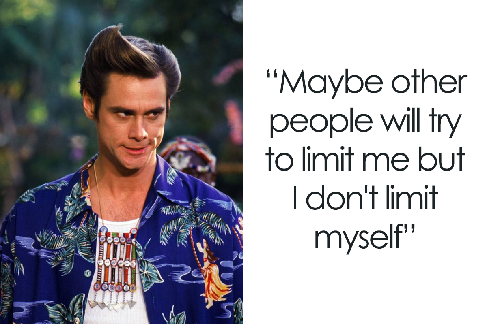

# Explorando os Recursos de IA Generativa com Copilot e OpenAI

O objetivo desse desafio foi escrever um resumo sobre o que foi apresentado e utilizar a IA para reconhecimento de texto em imagens.

## Resumo do que foi apresentado

### Fases de implementação de IA generativa responsável:
- Identificar: analisar os possíveis danos.
- Medida: presença desses dados.
- Mitigar: minimizar ou evitar os danos.
- Operar: plano e preparação operacional.

### O Copilot pode gerar:
- Respostas para perguntas.
- Imagens a partir de um texto que descreve essa imagem.
- Códigos para auxiliar no desenvolvimento de softwares.

## Reconhecimento de texto em imagem

Foi utilizado o site https://convertio.co para o reconhecimento de texto em imagem.

### Imagem 1

“Maybe other people will try to limit me but I don't limit myself”

### Imagem 2

Carta Aberta para Namorado
Meu amor, estou te escrevendo esta carta aberta para que não só vocc saiba, mas para que o mundo saiba e testemunhe o meu amor por você. Minha vida contigo ó maravilhosa em eada detalhe, em cada lugar, em cada momento, c c por isso que eu não me canso dc dividir cada pedacinho dela com você, dc fazer de você parte de mim.
modelodecartas.com.br

### Comentário

Na primeira imagem, o reconhecimento do texto foi realizado sem erros.

Já no segundo, ouve alguns erros de troca de letras entre "c" e "e".
